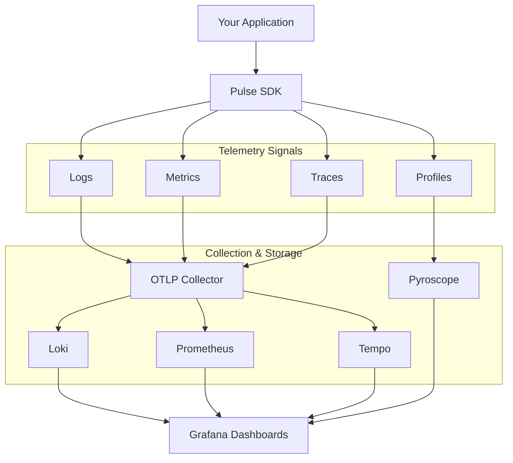

# Pulse

<!-- markdownlint-disable MD033 MD013 -->
<p align="center">
  
</p>

<p align="center">
  <strong>Unified Observability Framework</strong> - Production-grade logging, metrics,<br>
  tracing, and profiling for modern applications
</p>
<!-- markdownlint-enable MD033 MD013 -->

## Overview

**Pulse** is a comprehensive observability framework that provides unified
telemetry for your applications. Built on OpenTelemetry standards, Pulse
makes it easy to instrument your code with structured logging, distributed
tracing, metrics collection, and continuous profiling.

Pulse is now open-sourced by **Machani Robotics** to help teams build
observable, maintainable systems.

## Features

- **Structured Logging** - Context-aware logging with automatic trace correlation
- **Per-Module Log Levels** - Fine-grained verbosity control per service/module
- **Metrics Collection** - Counters, histograms, and gauges with OpenTelemetry
- **Distributed Tracing** - End-to-end request tracking across services
- **Continuous Profiling** - Production performance analysis with Pyroscope
- **MCAP Recording** - Offline analysis with Foxglove Studio
- **Zero-Config Integration** - Works out of the box with sensible defaults
- **OpenTelemetry Native** - Standard protocols for maximum compatibility

## Quick Start

### Go SDK

```bash
go get github.com/machanirobotics/pulse/pulse-go
```

```go
package main

import "github.com/machanirobotics/pulse/pulse-go"

func main() {
    // Auto-discovers pulse.toml config
    p, _ := pulse.New().Build()
    defer p.Close()

    p.Logger.Info("Service started")
}
```

**[Go SDK Docs →](pulse-go/README.md)**

### Python SDK

```bash
pip install git+https://github.com/machanirobotics/pulse.git#subdirectory=pulse-py
```

```python
from pulse import Pulse

# Auto-discovers pulse.toml config
with Pulse.new().build() as pulse:
    pulse.logger.info("Service started")
```

**[Python SDK Docs →](pulse-py/README.md)**

### Rust SDK

```bash
cargo add pulse
```

```rust
use pulse::{Pulse, logger};

#[tokio::main]
async fn main() -> anyhow::Result<()> {
    // Auto-discovers pulse.toml config
    let _pulse = Pulse::new().build()?;

    logger::info!("Service started");

    Ok(())
}
```

**[Rust SDK Docs →](pulse-rs/README.md)**

### Configuration (`pulse.toml`)

All SDKs auto-discover `pulse.toml` from your project root:

```toml
[service]
name = "my-service"
version = "1.0.0"
environment = "development"

[telemetry.otlp]
endpoint = "otel.example.com"  # Port 4317 auto-added
auth_token = "your-token"

[logging]
level = 2                        # Global log level (1=Error, 2=Info, 3=Debug)

[logging.modules.nats-module]
level = 1                        # Override: Error only for this module
```

**Priority:** Defaults → `pulse.toml` → `.env` / `PULSE_*` env vars → Code

**[Configuration Guide →](docs/configuration.md)**

## Observability Stack

Pulse includes a complete, pre-configured observability stack powered by
industry-standard tools:

- **Loki** - Log aggregation
- **Tempo** - Distributed tracing
- **Prometheus** - Metrics storage
- **Pyroscope** - Continuous profiling
- **Grafana** - Unified dashboards
- **OpenTelemetry Collector** - Telemetry pipeline

### Running the Stack

```bash
cd opentelemetry
docker compose up -d
```

Access Grafana at `http://localhost:3000` with all datasources pre-configured.

**[Observability Stack →](opentelemetry/README.md)** · **[Production Deployment →](opentelemetry/deploy/production/README.md)**

## Architecture



## Language Support

| Language | Status    | Documentation                            |
| -------- | --------- | ---------------------------------------- |
| Go       | ✅ Stable | [pulse-go/README.md](pulse-go/README.md) |
| Python   | ✅ Stable | [pulse-py/README.md](pulse-py/README.md) |
| Rust     | ✅ Stable | [pulse-rs/README.md](pulse-rs/README.md) |

## Use Cases

- **Microservices** - Track requests across service boundaries
- **API Services** - Monitor performance and errors
- **Robotics** - Record and analyze system behavior
- **ML Pipelines** - Trace data processing workflows
- **Production Debugging** - Correlate logs, traces, and metrics

## Contributing

We welcome contributions! Pulse is open-source and maintained by Machani Robotics.

1. Fork the repository
2. Create a feature branch
3. Make your changes
4. Submit a pull request

## License

Copyright © 2026 Machani Robotics

Licensed under the Apache License, Version 2.0. See [LICENSE](LICENSE) for details.

---

**Built with love by Machani Robotics** | Open Source Observability for Everyone
