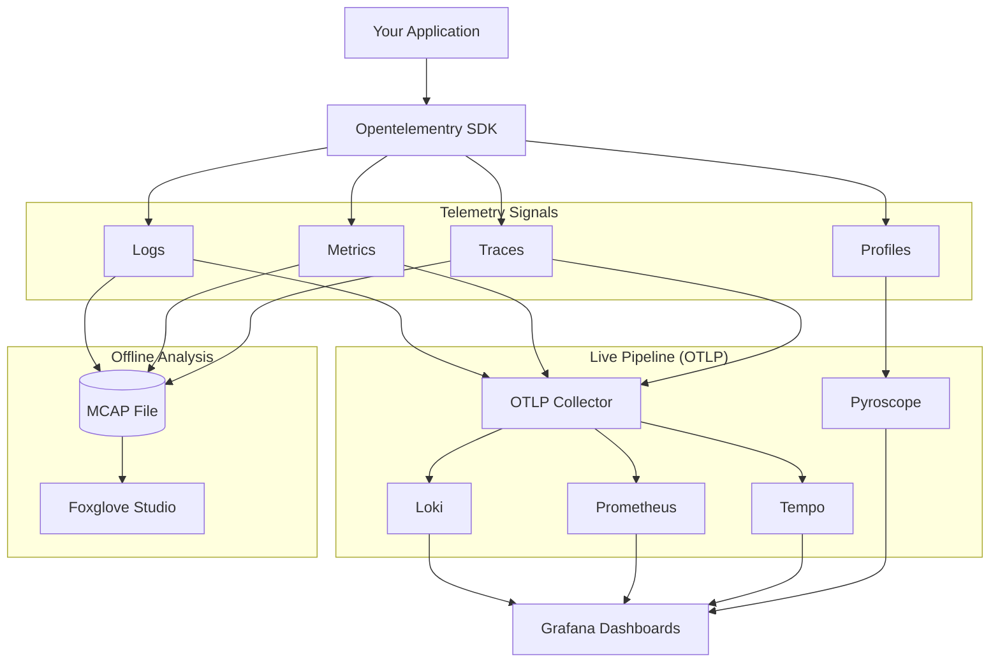

<!-- markdownlint-disable MD041 -->
<p align="center">
  
</p>

<h1 align="center">Opentelementry</h1>

<p align="center">
  <strong>One framework, every signal.</strong> Opentelementry is a unified,
  config-first observability framework for Go, Python, Rust, and C++ — structured
  logging, metrics, distributed tracing, and continuous profiling, built on
  OpenTelemetry standards and shipped with a batteries-included Grafana stack.
</p>

<p align="center">
  <a href="https://github.com/the-protobuf-project/opentelementry/actions/workflows/ci.yaml"></a>
  <a href="https://github.com/the-protobuf-project/opentelementry/actions/workflows/linter.yaml"></a>
  <a href="LICENSE"></a>
  
  
  
  
</p>

## Contents

- [Overview](#overview)
- [Features](#features)
- [Architecture](#architecture)
- [Language support](#language-support)
- [Configuration — `opentelementry.toml`](#configuration--opentelementrytoml)
- [Environment variables](#environment-variables)
- [Telemetry signals](#telemetry-signals)
- [Observability stack](#observability-stack)
- [Repository layout](#repository-layout)
- [Development](#development)
- [Use cases](#use-cases)
- [Contributing](#contributing)
- [License](#license)

## Overview

Opentelementry is a comprehensive observability framework that provides unified
telemetry across languages. Instrument your code once with a single fluent API and
get structured logging, distributed tracing, metrics collection, and continuous
profiling — exported over standard OTLP and, optionally, recorded to MCAP for
offline analysis in Foxglove Studio.

Every SDK shares the same mental model: build an `Opentelementry` instance from a
config file or code, then use the logger, metrics, and tracer it exposes. The same
`opentelementry.toml` drives all four languages.

## Features

- **Structured logging** — context-aware logging with automatic trace correlation.
- **Per-module log levels** — fine-grained verbosity control per service or module.
- **Metrics collection** — counters, histograms, and gauges with OpenTelemetry.
- **Distributed tracing** — end-to-end request tracking across service boundaries.
- **Continuous profiling** — production performance analysis with Pyroscope.
- **MCAP recording** — a single file for offline analysis in Foxglove Studio.
- **Config-first** — auto-discovers `opentelementry.toml`; TOML, YAML, JSON, and
  environment-variable overrides are all supported.
- **Zero-config defaults** — sensible defaults get you running with no setup.
- **OpenTelemetry native** — standard OTLP protocols for maximum compatibility.

## Architecture



## Language support

Four first-class SDKs share one configuration format and one API shape. Expand a
language for installation and a quick start.

| Language | Status | Minimum version | Documentation |
| -------- | ------ | --------------- | ------------- |
| Go       | Stable | 1.25            | [opentelementry-go](opentelementry-go/README.md) |
| Python   | Stable | 3.12            | [opentelementry-py](opentelementry-py/README.md) |
| Rust     | Stable | 1.91            | [opentelementry-rs](opentelementry-rs/README.md) |
| C++      | Beta   | C++17           | [opentelementry-cpp](opentelementry-cpp) |

<details>
<summary><strong>Go</strong></summary>

```bash
go get github.com/the-protobuf-project/opentelementry/opentelementry-go
```

```go
package main

import "github.com/the-protobuf-project/opentelementry/opentelementry-go"

func main() {
    // Auto-discovers opentelementry.toml or uses defaults.
    p, err := opentelementry.New().
        WithService("my-service", "1.0.0").
        Build()
    if err != nil {
        panic(err)
    }
    defer p.Close()

    p.Logger.Info("Service started")
}
```

See the [Go SDK documentation](opentelementry-go/README.md).

</details>

<details>
<summary><strong>Python</strong></summary>

```bash
pip install "git+https://github.com/the-protobuf-project/opentelementry.git#subdirectory=opentelementry-py"
```

```python
from opentelementry import Opentelementry

# Auto-discovers opentelementry.toml config.
with Opentelementry.new().build() as o:
    o.logger.info("Service started")
    o.logger.warning("Rate limit approaching", {"percent": 85})
```

See the [Python SDK documentation](opentelementry-py/README.md).

</details>

<details>
<summary><strong>Rust</strong></summary>

```toml
[dependencies]
opentelementry = { git = "https://github.com/the-protobuf-project/opentelementry.git" }
tokio = { version = "1", features = ["macros", "rt-multi-thread"] }
anyhow = "1.0"
```

```rust
use opentelementry::{Opentelementry, Environment, logger};

#[tokio::main]
async fn main() -> anyhow::Result<()> {
    // Auto-discovers opentelementry.toml config.
    let _opentelementry = Opentelementry::new()
        .with_service("my-service", "1.0.0")
        .environment(Environment::Production)
        .build()?;

    logger::info!("Service started");
    Ok(())
}
```

See the [Rust SDK documentation](opentelementry-rs/README.md).

</details>

<details>
<summary><strong>C++</strong></summary>

Add the module dependency in your `MODULE.bazel`:

```starlark
bazel_dep(name = "opentelementry.cpp", version = "1.0.0")
```

```cpp
#include <opentelementry/opentelementry.hpp>

int main() {
    auto o = opentelementry::Opentelementry::builder("my-service", "1.0.0")
        .environment(opentelementry::Environment::Development)
        .build();

    OPENTELEMENTRY_LOG_INFO("Service started");
    o.metrics().counter("requests_total", 1.0);

    auto span = o.tracer().start_span("process_request");
    span.set_attribute("user_id", "12345");
    span.end();
}
```

See the [C++ SDK sources and examples](opentelementry-cpp).

</details>

## Configuration — `opentelementry.toml`

All SDKs auto-discover `opentelementry.toml` from your project root:

```toml
[service]
name = "my-service"
version = "1.0.0"
environment = "development"

[telemetry.otlp]
endpoint = "otel.example.com"   # Port 4317 auto-added
auth_token = "your-token"

[logging]
level = 2                        # Global log level (1=Error, 2=Info, 3=Debug)

[logging.modules.nats-module]
level = 1                        # Override: Error only for this module
```

**Precedence** (lowest to highest): Defaults → `opentelementry.toml` → `.env` /
`OPENTELEMENTRY_*` environment variables → code.

See the full [Configuration Guide](docs/configuration.md).

## Environment variables

Every config key can be overridden with an `OPENTELEMENTRY_`-prefixed environment
variable. Nesting is expressed with a single underscore in Go, Rust, and C++, and a
double underscore in Python.

| Language        | Prefix            | Nesting            | Example |
| --------------- | ----------------- | ------------------ | ------- |
| Go / Rust / C++ | `OPENTELEMENTRY_` | `_` (single)       | `OPENTELEMENTRY_TELEMETRY_OTLP_ENDPOINT` |
| Python          | `OPENTELEMENTRY_` | `__` (double)      | `OPENTELEMENTRY_TELEMETRY__OTLP__ENDPOINT` |

```bash
export OPENTELEMENTRY_SERVICE_NAME=my-service
export OPENTELEMENTRY_TELEMETRY_OTLP_ENDPOINT=otel.example.com:4317
export OPENTELEMENTRY_LOGGING_MODULES_VISION_LEVEL=3
```

## Telemetry signals

| Signal      | What you get |
| ----------- | ------------ |
| Logging     | Structured, context-aware logs with trace correlation and per-module levels. |
| Metrics     | Counters, histograms, and gauges exported over OTLP. |
| Tracing     | Distributed spans with attributes and events across service boundaries. |
| Profiling   | Continuous CPU/memory profiling delivered to Pyroscope. |
| MCAP        | Unified recording of signals to an MCAP file for Foxglove Studio. |

## Observability stack

Opentelementry ships a complete, pre-configured stack in
[`opentelementry-core`](opentelementry-core/README.md), powered by
industry-standard tools:

- **Loki** — log aggregation
- **Tempo** — distributed tracing
- **Prometheus** — metrics storage
- **Pyroscope** — continuous profiling
- **Grafana** — unified dashboards
- **OpenTelemetry Collector** — telemetry pipeline

```bash
cd opentelementry-core
docker compose up -d
```

Grafana is then available at `http://localhost:3000` with all datasources
pre-configured.

**[Observability stack →](opentelementry-core/README.md)** ·
**[Production deployment →](opentelementry-core/deploy/production/README.md)**

## Repository layout

| Path | Description |
| ---- | ----------- |
| [`opentelementry-go`](opentelementry-go)     | Go SDK |
| [`opentelementry-py`](opentelementry-py)     | Python SDK |
| [`opentelementry-rs`](opentelementry-rs)     | Rust SDK (workspace: `opentelementry`, `opentelementry-derive`, `opentelementry-examples`) |
| [`opentelementry-cpp`](opentelementry-cpp)   | C++ SDK (CMake and Bazel) |
| [`opentelementry-core`](opentelementry-core) | Observability stack and production deployment |
| [`docs`](docs)                               | Configuration and usage guides |

## Development

Each SDK is self-contained and can be built and tested independently.

```bash
# Go
cd opentelementry-go && go build ./... && go test ./...

# Rust
cd opentelementry-rs && cargo build --all-targets && cargo test

# Python
cd opentelementry-py && pip install . && ruff check .

# C++ (Bazel)
cd opentelementry-cpp && bazel build //...
```

Continuous integration builds and tests all four SDKs and validates the
observability stack. See [`.github/workflows`](.github/workflows) for the CI and
release pipelines.

## Use cases

- **Microservices** — track requests across service boundaries.
- **API services** — monitor performance and errors.
- **Robotics** — record and analyze system behavior with MCAP.
- **ML pipelines** — trace data-processing workflows.
- **Production debugging** — correlate logs, traces, and metrics.

## Contributing

Contributions are welcome. Fork the repository, create a feature branch, make your
changes, and open a pull request. Please ensure the relevant SDK builds and its
tests and linters pass before submitting.

## License

Copyright &copy; 2026 Machani Robotics.

Licensed under the Apache License, Version 2.0. See [LICENSE](LICENSE) for details.
