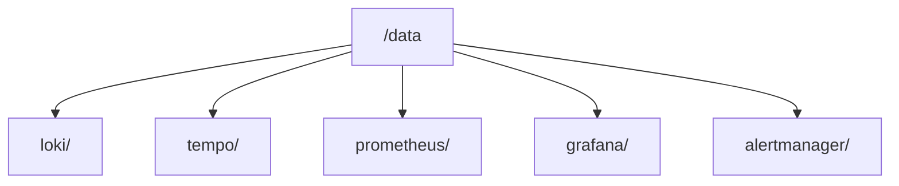
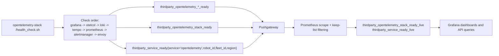

# OpenTelemetry Stack

Single image running Grafana, Prometheus, Pushgateway, Tempo, Loki, Alertmanager, OTel Collector, and Envoy under supervisord.

## Services

| Service        | Internal Port | Description                    |
| -------------- | ------------- | ------------------------------ |
| Loki           | 3100/3101     | Log aggregation                |
| Tempo          | 3200/3201     | Distributed tracing            |
| Prometheus     | 9090          | Metrics                        |
| Pushgateway    | 9091          | Prometheus pushed metrics      |
| Alertmanager   | 9093          | Alert routing                  |
| OTel Collector | 4317/4318     | OTLP gRPC/HTTP ingestion       |
| Grafana        | 3000          | Dashboard UI                   |
| Envoy          | 6009         | Reverse proxy for OTLP ingress |

## Exposed Port (default)

Only one ingress port is exposed by default:

| Port  | Service                          |
| ----- | -------------------------------- |
| 6009 | Envoy OTLP gateway (gRPC + HTTP) |

Use this single port mapping for external ingestion. Internal services continue to communicate on their native container ports.

## Quick Start

```bash
docker run -d \
  -p 6009:6009 \
  -v opentelemetry-stack-data:/data \
  --name opentelemetry-stack \
  ghcr.io/the-protobuf-project/opentelementry:latest
```

Images are published to GitHub Container Registry on each `v*` release:
`ghcr.io/the-protobuf-project/opentelementry` (multi-arch: `linux/amd64`, `linux/arm64`).

## Configuration

All configs are embedded in the image under `/etc/opentelemetry-stack`.

At runtime, the stack uses:

- `STACK_CONFIG_DIR=/config` (default)
- if `/config` is not mounted, entrypoint auto-links `/config -> /etc/opentelemetry-stack`
- optional override: mount your own folder and set `STACK_CONFIG_DIR`

### Environment Variables

| Variable                         | Default                | Description                              |
| -------------------------------- | ---------------------- | ---------------------------------------- |
| `ENABLE_ENVOY`                   | `true`                 | Enable Envoy reverse proxy               |
| `STACK_CONFIG_DIR`               | `/config`              | Stack config root directory              |
| `ENVOY_CONFIG`                   | `/config/envoy.yaml`   | Override Envoy config path               |
| `GRAFANA_DOMAIN`                 | `127.0.0.1`            | Public host/IP used by Grafana redirects |
| `HEALTH_METRICS_PUSHGATEWAY_URL` | —                      | Push health metrics to Pushgateway       |
| `HEALTH_METRICS_JOB`             | `opentelemetry-health` | Job label for pushed health metrics      |
| `HEALTH_METRICS_INSTANCE`        | container hostname     | Instance label for pushed health metrics |
| `HEALTH_METRICS_PUSH_STRICT`     | `false`                | Fail health check if push fails          |
| `ROBOT_ID`                       | `unknown`              | Metric label for robot identity          |
| `FLEET_ID`                       | `unknown`              | Metric label for fleet identity          |
| `REGION`                         | `unknown`              | Metric label for deployment region       |

### OTLP client endpoints (single external port)

- OTLP gRPC: `http://<host>:6009`
- OTLP HTTP: `http://<host>:6009/v1/traces` (or `/v1/metrics`, `/v1/logs`)

### Service endpoints via single external port

- Grafana UI: `http://<host>:6009/grafana/`
- Loki API: `http://<host>:6009/logs/...`
- Prometheus: `http://<host>:6009/metrics/...`
- Tempo HTTP API: `http://<host>:6009/traces/...`
- Alertmanager UI/API: `http://<host>:6009/alertmanager/`
- Pushgateway: `http://<host>:6009/pushgateway/...`
- OTel Collector health: `http://<host>:6009/otelcol/`
- Envoy admin: `http://<host>:6009/envoy/` (powerful — trusted networks only)

Every internal service port is reachable through the single `6009` ingress; no
other port needs to be published.

### Curated readiness metrics

This stack keeps only curated `thirdparty_*` health metrics in Prometheus.

Common metric:

- `thirdparty_service_ready{service="<service-name>",robot_id="...",fleet_id="...",region="..."}`

Stack-specific health metrics include:

- `thirdparty_opentelemetry_stack_ready`
- `thirdparty_opentelemetry_grafana_ready`
- `thirdparty_opentelemetry_otelcol_ready`
- `thirdparty_opentelemetry_loki_ready`
- `thirdparty_opentelemetry_tempo_ready`
- `thirdparty_opentelemetry_prometheus_ready`
- `thirdparty_opentelemetry_alertmanager_ready`
- `thirdparty_opentelemetry_envoy_ready`

Freshness-adjusted recording rules expose `_live` variants (for example `thirdparty_service_ready_live`) that turn to `0` when Pushgateway series are stale.

## Data Volume

All persistent data is stored under `/data`:



## Health Check

```bash
docker exec opentelemetry-stack /health_check.sh
```

Health checks execute in this order:

1. `grafana`
2. `otelcol`
3. `loki`
4. `tempo`
5. `prometheus`
6. `alertmanager`
7. `envoy`

## Build

```bash
./build.sh local    # build locally for testing
./build.sh amd64    # build + push to ECR
```

## Prometheus Flow


