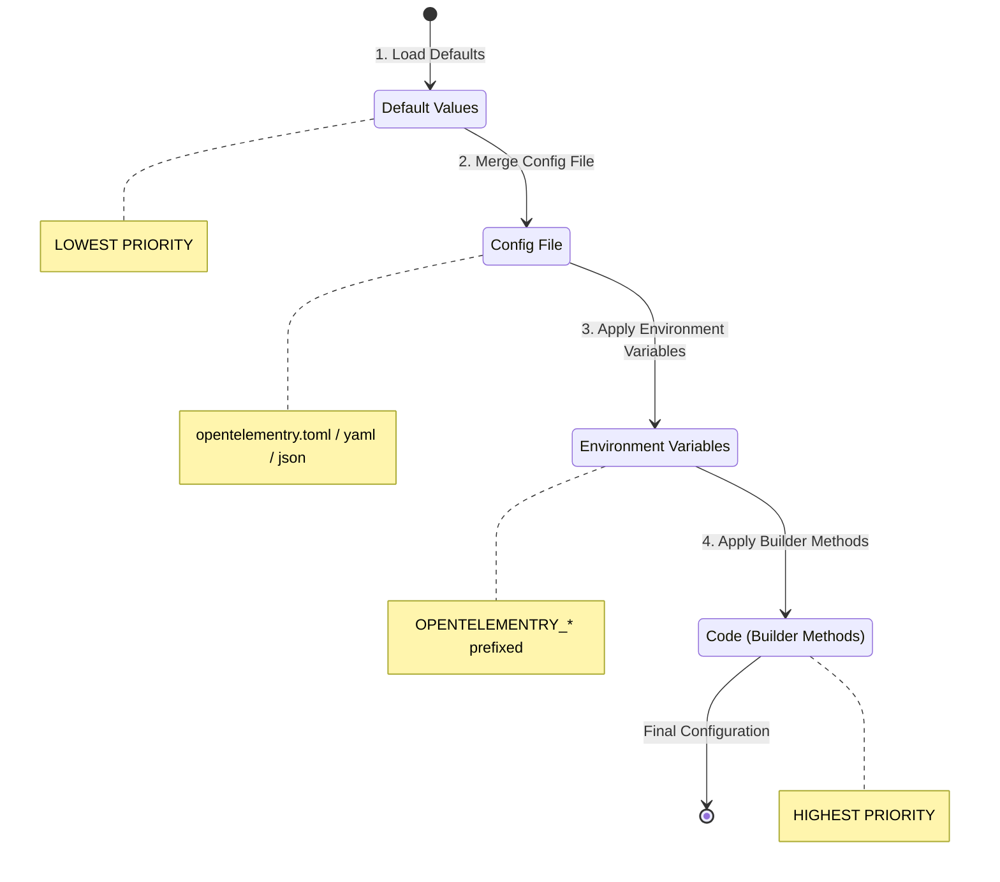
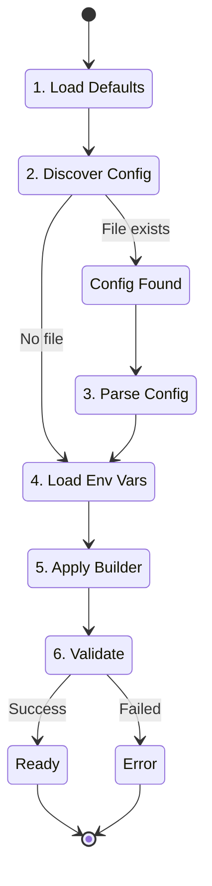
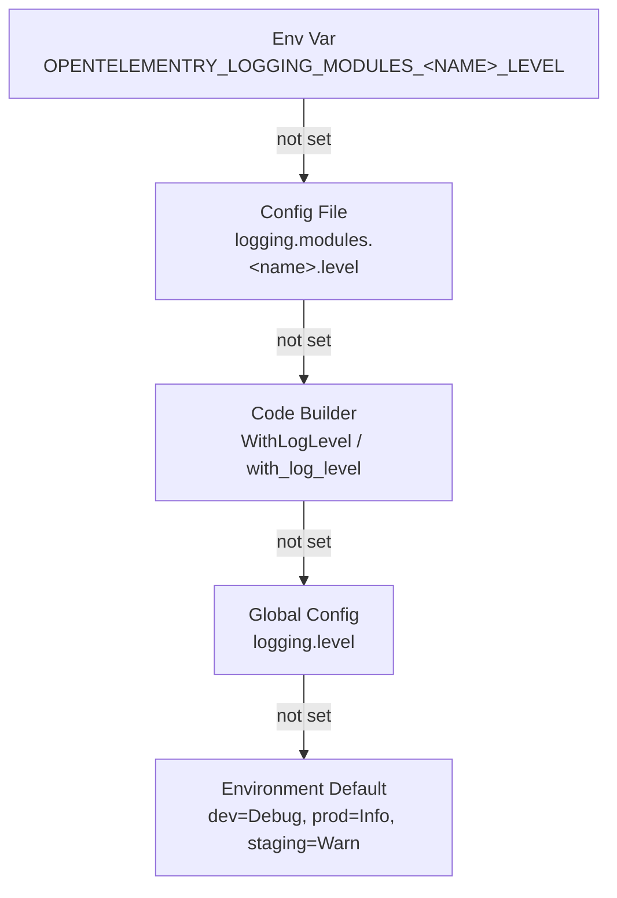

# Opentelementry Configuration Guide

Comprehensive documentation on `opentelementry.toml` configuration, lifecycle,
supported formats, and all available options.

## Table of Contents

- [Overview](#overview)
- [Supported Formats](#supported-formats)
- [Configuration Priority](#configuration-priority)
- [Configuration Lifecycle](#configuration-lifecycle)
- [File Discovery](#file-discovery)
- [Environment Variables](#environment-variables)
- [Per-Module Log Levels](#per-module-log-levels)
- [Complete Configuration Reference](#complete-configuration-reference)
- [SDK-Specific Details](#sdk-specific-details)

---

## Overview

Opentelementry uses a unified configuration system across all SDKs (Go, Python, Rust).
The configuration defines:

- **Service identity** - Name, version, environment, and custom attributes
- **Telemetry settings** - OTLP export, metrics intervals
- **Logging options** - Caller info, timestamps, log levels
- **Tracing configuration** - Distributed tracing settings
- **Profiling** - Continuous profiling with Pyroscope
- **MCAP recording** - Foxglove Studio integration

---

## Supported Formats

Opentelementry supports multiple configuration file formats, auto-detected by file extension:

| Format | Extensions | Parser Library |
|--------|------------|----------------|
| TOML   | `.toml`    | Go: `knadh/koanf`, Python: `dynaconf`, Rust: `figment` |
| YAML   | `.yaml`, `.yml` | Same as above |
| JSON   | `.json`    | Same as above |

**Recommended:** Use TOML for its readability and native support for nested structures.

### Format Examples

**TOML** (Recommended):

```toml
[service]
name = "my-service"
version = "1.0.0"

[telemetry.otlp]
endpoint = "otel.example.com:4317"
```

**YAML**:

```yaml
service:
  name: my-service
  version: "1.0.0"

telemetry:
  otlp:
    endpoint: otel.example.com:4317
```

**JSON**:

```json
{
  "service": {
    "name": "my-service",
    "version": "1.0.0"
  },
  "telemetry": {
    "otlp": {
      "endpoint": "otel.example.com:4317"
    }
  }
}
```

---

## Configuration Priority

Configuration is loaded and merged in the following order (lowest to highest priority):



**Key Points:**

- Later sources override earlier sources
- Environment variables always override config file values
- Builder methods in code have the final say
- Unspecified values fall back to sensible defaults

---

## Configuration Lifecycle

### 1. Initialization Phase

When you call `Opentelementry.new()` (or equivalent), the SDK begins the
configuration loading process:



### 2. Runtime Behavior

Once initialized, configuration is **immutable**. To change configuration:

1. Close the existing Opentelementry instance
2. Create a new instance with updated configuration

---

## File Discovery

Opentelementry auto-discovers configuration files in this order:

### Discovery Priority

1. **`OPENTELEMENTRY_CONFIG_PATH` environment variable** (if set)
2. **Current directory:**
   - `opentelementry.toml`
   - `opentelementry.yaml` / `opentelementry.yml`
   - `opentelementry.json`
3. **`.config` subdirectory:**
   - `.config/opentelementry.toml`
   - `.config/opentelementry.yaml` / `.config/opentelementry.yml`
   - `.config/opentelementry.json`

### Discovery Algorithm

```text
function discoverConfigPath():
    // 1. Check environment variable first
    if OPENTELEMENTRY_CONFIG_PATH is set and file exists:
        return OPENTELEMENTRY_CONFIG_PATH

    // 2. Search in current directory
    for ext in [".toml", ".yaml", ".yml", ".json"]:
        if "opentelementry{ext}" exists:
            return "opentelementry{ext}"

    // 3. Search in .config directory
    for ext in [".toml", ".yaml", ".yml", ".json"]:
        if ".config/opentelementry{ext}" exists:
            return ".config/opentelementry{ext}"

    // 4. No config file found - use defaults only
    return null
```

### Explicit Path

You can bypass auto-discovery by specifying a path:

**Go:**

```go
opts, svc, _ := options.LoadConfigWithDefaults("/path/to/config.toml")
```

**Python:**

```python
from opentelementry.options import from_config
service_opts, opentelementry_opts = from_config("/path/to/config.toml")
```

**Rust:**

```rust
let config = OpentelementryConfig::load_from("/path/to/config.toml")?;
```

---

## Environment Variables

Environment variables provide runtime configuration without modifying files.

### Naming Convention

| SDK | Prefix | Separator | Example |
|-----|--------|-----------|---------|
| Go | `OPENTELEMENTRY_` | `_` (single underscore) | `OPENTELEMENTRY_TELEMETRY_OTLP_ENDPOINT` |
| Python | `OPENTELEMENTRY_` | `__` (double underscore) | `OPENTELEMENTRY_TELEMETRY__OTLP__EP` |
| Rust | `OPENTELEMENTRY_` | `_` (single underscore) | `OPENTELEMENTRY_TELEMETRY_OTLP_ENDPOINT` |

### Transformation Rules

Environment variable names are transformed to config paths:

```text
OPENTELEMENTRY_SERVICE_NAME        → service.name
OPENTELEMENTRY_TELEMETRY_OTLP_HOST → telemetry.otlp.host
OPENTELEMENTRY_FOXGLOVE_ENABLED    → foxglove.enabled
```

### Common Environment Variables

```bash
# Service Configuration
OPENTELEMENTRY_SERVICE_NAME=my-service
OPENTELEMENTRY_SERVICE_VERSION=1.0.0
OPENTELEMENTRY_SERVICE_ENVIRONMENT=production

# OTLP Configuration
OPENTELEMENTRY_TELEMETRY_OTLP_ENDPOINT=otel.example.com:4317
OPENTELEMENTRY_TELEMETRY_OTLP_AUTH_TOKEN=your-bearer-token
OPENTELEMENTRY_TELEMETRY_OTLP_SECURE=true

# Feature Toggles
OPENTELEMENTRY_FOXGLOVE_ENABLED=true
OPENTELEMENTRY_PROFILING_ENABLED=true
OPENTELEMENTRY_TRACING_ENABLED=true

# Config File Override
OPENTELEMENTRY_CONFIG_PATH=/etc/opentelementry/config.toml
```

### Using `.env` Files

Python SDK supports `.env` files via `dynaconf`:

```bash
# .env
OPENTELEMENTRY_SERVICE__NAME=my-service
OPENTELEMENTRY_TELEMETRY__OTLP__ENDPOINT=otel.example.com:4317
```

---

## Per-Module Log Levels

Opentelementry supports per-module log level control, allowing each service/module in a
multi-module system to have its own verbosity. This is especially useful in
robotics, where stable modules (e.g., NATS transport) should be quiet while
modules under active development (e.g., vision) need full debug output.

### Log Level Values

| Value | Name | Meaning | Use Case |
|-------|------|---------|----------|
| `0` | Unset | No explicit level; falls back to next source in the priority chain | Default |
| `1` | Level 1 (Error) | Error messages only | Stable, production-ready modules |
| `2` | Level 2 (Info) | Info + Error | Normal operation, standard telemetry |
| `3` | Level 3 (Debug) | Debug + Info + Error | Active development, full observability |

### Priority Chain

The effective log level for a module is resolved using the following priority
chain (highest to lowest):

```text
1. Environment variable   OPENTELEMENTRY_LOGGING_MODULES_<NAME>_LEVEL   (highest)
2. Config file            [logging.modules.<name>] level = N
3. Code-level builder     WithLogLevel() / with_log_level()
4. Global config level    [logging] level = N
5. Environment default    dev=Debug, prod=Info, staging=Warn     (lowest)
```



### Config File Setup

Define per-module overrides under `[logging.modules.<service-name>]`:

```toml
# opentelementry.toml

[logging]
level = 2                          # Global default: Info

[logging.modules.nats-module]
level = 1                          # Override: Error only (stable module)

[logging.modules.vision-module]
level = 3                          # Override: Debug (active development)
```

**YAML equivalent:**

```yaml
logging:
  level: 2
  modules:
    nats-module:
      level: 1
    vision-module:
      level: 3
```

**JSON equivalent:**

```json
{
  "logging": {
    "level": 2,
    "modules": {
      "nats-module": { "level": 1 },
      "vision-module": { "level": 3 }
    }
  }
}
```

### Environment Variable Override

Override any module's level at runtime without changing config files or code:

```bash
# Override nats-module to Debug (level 3)
export OPENTELEMENTRY_LOGGING_MODULES_NATS_MODULE_LEVEL=3

# Override vision-module to Error only (level 1)
export OPENTELEMENTRY_LOGGING_MODULES_VISION_MODULE_LEVEL=1
```

> **Note:** Hyphens in service names are replaced with underscores in
> environment variable names (e.g., `nats-module` → `NATS_MODULE`).

### Code-Level Usage

Each SDK provides a builder method to set the log level in code. This acts as
the code-level default and can be overridden by config file or env vars.

**Go:**

```go
p, err := opentelementry.New().
    WithService("vision", "1.0.0").
    WithLogLevel(opentelementry.ModuleLevel_3).  // Level 3 = Debug
    Build()
```

**Python:**

```python
from opentelementry import Opentelementry
from opentelementry.options import LogLevel

opentelementry = Opentelementry.new() \
    .with_service("vision", "1.0.0") \
    .with_log_level(LogLevel.MODULE_LEVEL_3) \
    .build()
```

**Rust:**

```rust
use opentelementry::{Opentelementry, LogLevel};

let opentelementry = Opentelementry::new()
    .with_service("vision", "1.0.0")
    .with_log_level(LogLevel::ModuleLevel_3)
    .build()?;
```

### Multi-Module Example

A typical robotics system with multiple modules, each at a different log level:

```toml
# opentelementry.toml — shared config for all modules on this robot

[service]
name = "robot-core"
environment = "development"

[service.attributes]
robot_id = "robot-001"

[logging]
level = 2                              # Global default: Info

# Stable transport layer — errors only
[logging.modules.nats-module]
level = 1

# Vision pipeline under active development — full debug
[logging.modules.vision-module]
level = 3

# Motor controller — normal operation
[logging.modules.motor-module]
level = 2
```

With this config:

| Module | Effective Level | Visible Messages |
|--------|----------------|------------------|
| `robot-core` | 2 (Info) — from global `logging.level` | Info, Warn, Error |
| `nats-module` | 1 (Error) — from per-module override | Error only |
| `vision-module` | 3 (Debug) — from per-module override | Debug, Info, Warn, Error |
| `motor-module` | 2 (Info) — from per-module override | Info, Warn, Error |
| `new-module` (no override) | 2 (Info) — falls back to global | Info, Warn, Error |

### LogLevel Constants by SDK

| Level | Go | Python | Rust |
|-------|-----|--------|------|
| Unset (0) | `opentelementry.ModuleLevel_Unset` | `LogLevel.UNSET` | `LogLevel::Unset` |
| Error (1) | `opentelementry.ModuleLevel_1` | `LogLevel.MODULE_LEVEL_1` | `LogLevel::ModuleLevel_1` |
| Info (2) | `opentelementry.ModuleLevel_2` | `LogLevel.MODULE_LEVEL_2` | `LogLevel::ModuleLevel_2` |
| Debug (3) | `opentelementry.ModuleLevel_3` | `LogLevel.MODULE_LEVEL_3` | `LogLevel::ModuleLevel_3` |

---

## Complete Configuration Reference

### Full `opentelementry.toml` Example

```toml
# =============================================================================
# Service Configuration
# =============================================================================
[service]
name = "my-service"           # Required: Your service name
version = "1.0.0"             # Service version (semver recommended)
environment = "development"   # development | staging | production | jetson
description = "My awesome service"

# Global attributes added to ALL telemetry (logs, metrics, traces)
# Useful for robot IDs, device IDs, fleet IDs, etc.
[service.attributes]
robot_id = "robot-001"
fleet_id = "fleet-alpha"
region = "us-west-2"

# =============================================================================
# Telemetry Configuration (OpenTelemetry)
# =============================================================================
[telemetry]
enabled = true  # Master switch: enables logging, metrics, and tracing

# OTLP Exporter Configuration
# Sends telemetry to any OpenTelemetry-compatible backend:
#   - Grafana Cloud, Datadog, Honeycomb, Jaeger, etc.
[telemetry.otlp]
enabled = true
endpoint = "localhost:4317"   # OTLP endpoint (port auto-detected if omitted)
auth_token = ""               # Bearer token for authentication (optional)
secure = false                # Use TLS (auto-detected for non-localhost)
use_http = false              # Use HTTP instead of gRPC (default: gRPC)

# Custom headers for OTLP requests
[telemetry.otlp.headers]
# X-Custom-Header = "value"

# Metrics export interval
[telemetry.metrics]
export_interval_seconds = 10

# =============================================================================
# Logging Configuration
# =============================================================================
[logging]
level = 2                        # Global module log level (0=Unset, 1=Error, 2=Info, 3=Debug)

[logging.log]
report_caller = true             # Include file:line in logs
report_timestamp = true          # Include timestamp in logs
level = "info"                   # debug | info | warn | error
caller_offset = 3                # Stack frame offset for caller info

# Per-module log level overrides
# Each module can have its own log level, keyed by service name.
# These override the global logging.level for that specific module.
[logging.modules.nats-module]
level = 1                        # Error only — this module is stable

[logging.modules.vision-module]
level = 3                        # Debug — this module is in active development

# =============================================================================
# Foxglove MCAP Recording (Optional)
# =============================================================================
# Record logs/metrics to MCAP files for Foxglove Studio playback
[foxglove]
enabled = false
file_path = ""                # e.g., "./recordings/session.mcap"

# =============================================================================
# Continuous Profiling (Optional)
# =============================================================================
# Send CPU/memory profiles to Pyroscope or Grafana Cloud
[profiling]
enabled = false
server_address = "http://localhost:4040"
basic_auth_user = ""          # For Grafana Cloud
basic_auth_password = ""

# =============================================================================
# Distributed Tracing
# =============================================================================
[tracing]
enabled = true
sample_ratio = 1.0            # 0.0 to 1.0 (Rust only)
```

### Configuration Options Reference

#### `[service]` - Service Identity

| Option | Type | Default | Description |
|--------|------|---------|-------------|
| `name` | string | `"unnamed-service"` | Service name for identification |
| `version` | string | `"1.0.0"` | Service version (semver) |
| `environment` | string | `"development"` | Deployment environment |
| `description` | string | `""` | Human-readable description |

#### `[service.attributes]` - Custom Attributes

Key-value pairs added to all telemetry signals. Useful for:

- Robot/device identification
- Fleet/region tagging
- Custom metadata

#### `[telemetry]` - Telemetry Master Settings

| Option | Type | Default | Description |
|--------|------|---------|-------------|
| `enabled` | bool | `true` | Master switch for all telemetry |

#### `[telemetry.otlp]` - OTLP Exporter

| Option | Type | Default | Description |
|--------|------|---------|-------------|
| `enabled` | bool | `false` | Enable OTLP export |
| `endpoint` | string | `"localhost:4317"` | OTLP collector endpoint |
| `auth_token` | string | `""` | Bearer token for auth |
| `secure` | bool | `false` | Use TLS connection |
| `use_http` | bool | `false` | Use HTTP instead of gRPC |
| `headers` | map | `{}` | Custom HTTP headers |

#### `[telemetry.metrics]` - Metrics Settings

| Option | Type | Default | Description |
|--------|------|---------|-------------|
| `export_interval_seconds` | int | `10` | Metrics export interval |

#### `[logging]` - Logging Settings

| Option | Type | Default | Description |
|--------|------|---------|-------------|
| `level` | int | `0` (Unset) | Global module log level (0=Unset, 1=Error, 2=Info, 3=Debug) |
| `modules` | map | `{}` | Per-module log level overrides keyed by service name |

#### `[logging.modules.<name>]` - Per-Module Overrides

| Option | Type | Default | Description |
|--------|------|---------|-------------|
| `level` | int | `0` (Unset) | Log level override for this module (1=Error, 2=Info, 3=Debug) |

#### `[logging.log]` - Log Output Settings

| Option | Type | Default | Description |
|--------|------|---------|-------------|
| `report_caller` | bool | `true` | Include file:line in logs |
| `report_timestamp` | bool | `true` | Include timestamp |
| `level` | string | `"info"` | Log level string (debug, info, warn, error) |
| `caller_offset` | int | `3` | Stack frame offset |

#### `[foxglove]` - MCAP Recording

| Option | Type | Default | Description |
|--------|------|---------|-------------|
| `enabled` | bool | `false` | Enable MCAP recording |
| `file_path` | string | `""` | Output file path |

#### `[profiling]` - Continuous Profiling

| Option | Type | Default | Description |
|--------|------|---------|-------------|
| `enabled` | bool | `false` | Enable profiling |
| `server_address` | string | `"http://localhost:4040"` | Pyroscope server |
| `basic_auth_user` | string | `""` | Auth username |
| `basic_auth_password` | string | `""` | Auth password |

#### `[tracing]` - Distributed Tracing

| Option | Type | Default | Description |
|--------|------|---------|-------------|
| `enabled` | bool | `true` | Enable tracing |
| `sample_ratio` | float | `1.0` | Sampling ratio (Rust only) |

---

## SDK-Specific Details

### Go SDK

**Config Library:** [knadh/koanf](https://github.com/knadh/koanf)

```go
package main

import (
    "github.com/the-protobuf-project/opentelementry/opentelementry-go"
    "github.com/the-protobuf-project/opentelementry/opentelementry-go/options"
)

func main() {
    // Auto-discover config
    p, _ := opentelementry.New().Build()
    defer p.Close()

    // With per-module log level
    vision, _ := opentelementry.New().
        WithService("vision", "1.0.0").
        WithLogLevel(opentelementry.ModuleLevel_3).  // Debug
        Build()
    defer vision.Close()

    // Or load config explicitly
    opentelementryOpts, serviceOpts, _ := options.LoadConfigWithDefaults("")

    // Or specify path
    opentelementryOpts, serviceOpts, _ := options.LoadConfigWithDefaults("/path/to/config.toml")
}
```

**Environment Variable Format:** Single underscore separator

```bash
OPENTELEMENTRY_TELEMETRY_OTLP_ENDPOINT=localhost:4317
OPENTELEMENTRY_LOGGING_MODULES_VISION_LEVEL=3
```

### Python SDK

**Config Library:** [dynaconf](https://www.dynaconf.com/)

```python
from opentelementry import Opentelementry
from opentelementry.options import from_config, LogLevel

# Auto-discover config
with Opentelementry.new().build() as opentelementry:
    opentelementry.logger.info("Hello")

# With per-module log level
vision = Opentelementry.new() \
    .with_service("vision", "1.0.0") \
    .with_log_level(LogLevel.MODULE_LEVEL_3) \
    .build()

# Or load config explicitly
service_opts, opentelementry_opts = from_config()

# Or specify path
service_opts, opentelementry_opts = from_config("/path/to/config.toml")
```

**Environment Variable Format:** Double underscore separator

```bash
OPENTELEMENTRY_TELEMETRY__OTLP__ENDPOINT=localhost:4317
OPENTELEMENTRY_LOGGING__MODULES__VISION__LEVEL=3
```

**`.env` File Support:** Yes (auto-loaded)

### Rust SDK

**Config Library:** [figment](https://docs.rs/figment)

```rust
use opentelementry::{Opentelementry, OpentelementryConfig, LogLevel};

#[tokio::main]
async fn main() -> anyhow::Result<()> {
    // Auto-discover config
    let _opentelementry = Opentelementry::new().build()?;

    // With per-module log level
    let _vision = Opentelementry::new()
        .with_service("vision", "1.0.0")
        .with_log_level(LogLevel::ModuleLevel_3)  // Debug
        .build()?;

    // Or load config explicitly
    let config = OpentelementryConfig::load()?;

    // Or specify path
    let config = OpentelementryConfig::load_from("/path/to/config.toml")?;

    Ok(())
}
```

**Environment Variable Format:** Single underscore separator

```bash
OPENTELEMENTRY_TELEMETRY_OTLP_ENDPOINT=localhost:4317
OPENTELEMENTRY_LOGGING_MODULES_VISION_LEVEL=3
```

---

## Best Practices

### 1. Use Environment Variables for Secrets

Never commit secrets to config files:

```toml
# opentelementry.toml - NO SECRETS HERE
[telemetry.otlp]
endpoint = "otel.example.com:4317"
# auth_token loaded from environment
```

```bash
# Set via environment
export OPENTELEMENTRY_TELEMETRY_OTLP_AUTH_TOKEN="your-secret-token"
```

### 2. Environment-Specific Configs

Use different config files per environment:

```text
config/
├── opentelementry.development.toml
├── opentelementry.staging.toml
└── opentelementry.production.toml
```

```bash
export OPENTELEMENTRY_CONFIG_PATH=config/opentelementry.production.toml
```

### 3. Use Service Attributes for Context

Add identifying attributes for better observability:

```toml
[service.attributes]
robot_id = "robot-001"
fleet_id = "fleet-alpha"
deployment_id = "deploy-abc123"
```

### 4. Start with Defaults

Opentelementry works out of the box. Only configure what you need:

```toml
# Minimal production config
[service]
name = "my-service"

[telemetry.otlp]
endpoint = "otel.example.com:4317"
auth_token = "token"
```

---

## Troubleshooting

### Config Not Loading

1. **Check file exists:** Ensure `opentelementry.toml` is in the current working directory
2. **Check permissions:** File must be readable
3. **Validate syntax:** Use a TOML validator
4. **Check discovery:** Set `OPENTELEMENTRY_CONFIG_PATH` explicitly

### Environment Variables Not Working

1. **Check prefix:** Must start with `OPENTELEMENTRY_`
2. **Check separator:** Go/Rust use `_`, Python uses `__`
3. **Check case:** Variable names are case-insensitive for keys

### Debug Configuration Loading

Enable debug logging to see configuration sources:

```bash
# See which config file is loaded
RUST_LOG=opentelementry=debug cargo run

# Python
OPENTELEMENTRY_DEBUG=true python app.py
```
