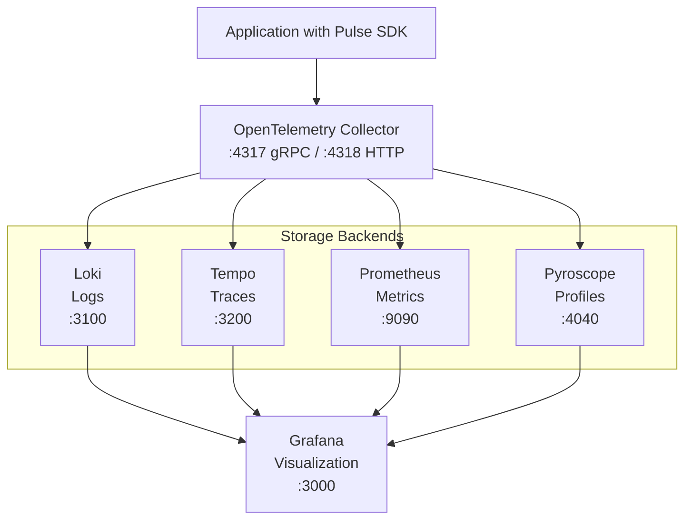

# Observability Stack

Logging, tracing, metrics, and profiling for Pulse applications.

## Features

- **Logs** - Centralized log aggregation with Loki
- **Traces** - Distributed tracing with Tempo
- **Metrics** - Time-series metrics with Prometheus
- **Profiles** - Continuous profiling with Pyroscope
- **Unified Dashboard** - Grafana with pre-configured datasources
- **OpenTelemetry** - Industry-standard telemetry collection

## Architecture



## Quick Start (Development)

### Prerequisites

- Docker & Docker Compose
- Git

### Start the Stack

```bash
docker compose up -d
```

Wait for all services to be healthy:

```bash
docker compose ps
```

### Access Services

| Service | URL | Description |
|---------|-----|-------------|
| Grafana | <http://localhost:3000> | Dashboard (no login required) |
| Prometheus | <http://localhost:9090> | Metrics UI |
| Loki | <http://localhost:3100> | Logs API |
| Tempo | <http://localhost:3200> | Traces API |
| Pyroscope | <http://localhost:4040> | Profiling UI |
| OTLP gRPC | localhost:4317 | Telemetry ingestion |
| OTLP HTTP | localhost:4318 | Telemetry ingestion |

### Pre-configured Datasources

All datasources are automatically configured in Grafana with correlation:

- **Loki** - Logs with trace ID linking
- **Tempo** - Traces with log/metric correlation
- **Prometheus** - Metrics with exemplars
- **Pyroscope** - Continuous profiling

### Stop the Stack

```bash
docker compose down

# To remove all data:
docker compose down -v
```

## Production Deployment

For production deployment on AWS EC2, see [deploy/production/README.md](deploy/production/README.md).

**Highlights:**

- Single EC2 instance with Docker Compose
- Envoy proxy for TLS termination and routing
- Alertmanager for notifications
- Cost: ~$15-20/month (no EKS!)

## Sending Telemetry

### Environment Variables

```bash
export OTEL_EXPORTER_OTLP_ENDPOINT=http://localhost:4317
export OTEL_SERVICE_NAME=my-service
```

### Go Example

```go
import "go.opentelemetry.io/otel"

// Traces
tracer := otel.Tracer("my-service")
ctx, span := tracer.Start(ctx, "operation")
defer span.End()

// Logs (via OTLP)
logger.Info("message", "trace_id", span.SpanContext().TraceID())
```

### Python Example

```python
from opentelemetry import trace

tracer = trace.get_tracer("my-service")
with tracer.start_as_current_span("operation"):
    # your code
```

## Running Examples

### MCAP Logging Example

```bash
cd examples/mcap
go run main.go
```

### Profiling Example

```bash
cd examples/profiling
go run main.go
```

View results:

- Logs: Grafana → Explore → Loki
- Traces: Grafana → Explore → Tempo
- Profiles: Grafana → Explore → Pyroscope

## Project Structure

```text
opentelemetry/
├── compose.yaml           # Development Docker Compose
├── config/                # Service configurations
│   ├── grafana-datasources.yaml
│   ├── otel-collector.yaml
│   ├── prometheus.yaml
│   └── ...
├── dashboards/            # Grafana dashboards
├── deploy/
│   └── production/        # Production deployment
│       ├── terraform/     # AWS infrastructure
│       ├── scripts/       # Deployment scripts
│       └── config/        # Production configs
├── docker/                # Custom Dockerfiles
└── examples/              # Usage examples
```

## Contributing

We welcome contributions! Pulse is open-source and maintained by Machani Robotics.

1. Fork the repository
2. Create a feature branch
3. Make your changes
4. Submit a pull request

## License

Copyright © 2026 Machani Robotics

Licensed under the Apache License, Version 2.0.
