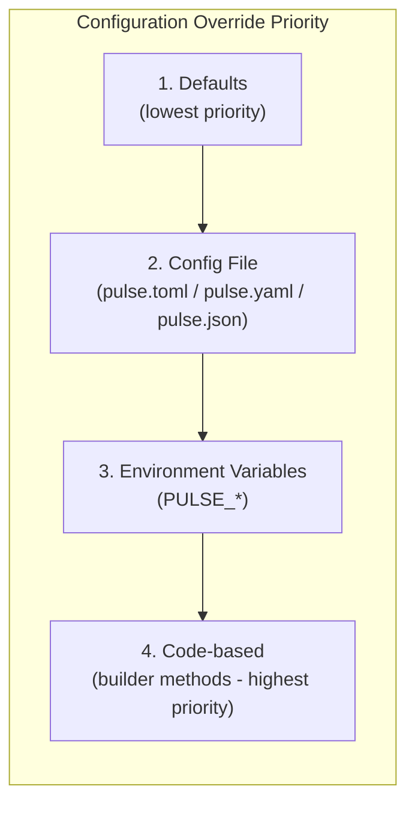

# Pulse - Rust SDK

A comprehensive observability framework for Rust applications, providing
unified logging, metrics, and distributed tracing with OpenTelemetry
integration and MCAP recording for Foxglove Studio.

## Features

- **Structured Logging** - Colored console output with OpenTelemetry export
- **Metrics Collection** - Counters, histograms, and gauges with derive macro
- **Distributed Tracing** - OpenTelemetry-based tracing with automatic instrumentation
- **MCAP Recording** - Record telemetry to MCAP files for Foxglove Studio
- **Figment Configuration** - TOML/YAML/JSON config with environment variable overrides
- **Zero-Config** - Sensible defaults, auto-discovers `pulse.toml`
- **Async-First** - Built on Tokio for high-performance async applications

## Installation

```toml
[dependencies]
pulse = { git = "https://github.com/machanirobotics/pulse.git" }
tokio = { version = "1", features = ["macros", "rt-multi-thread"] }
anyhow = "1.0"
serde = { version = "1.0", features = ["derive"] }
```

**Requirements:** Rust 1.91.0+

## Quick Start

```rust
use pulse::{Pulse, Environment, logger};

#[tokio::main]
async fn main() -> anyhow::Result<()> {
    // Auto-discovers pulse.toml config file
    let _pulse = Pulse::new()
        .with_service("my-service", "1.0.0")
        .environment(Environment::Production)
        .build()?;

    logger::info!("Service started");
    logger::warn!("Warning message");
    logger::error!("Error occurred");

    Ok(())
}
```

## Configuration

### Override Priority (Lowest to Highest)



### Config File (pulse.toml)

Auto-discovered from:

1. `PULSE_CONFIG_PATH` environment variable
2. `pulse.toml` in current directory
3. `.config/pulse.toml`

```toml
# pulse.toml
[service]
name = "my-service"
version = "1.0.0"
environment = "development"   # development | staging | production
description = "My awesome service"

# Global attributes added to ALL telemetry
[service.attributes]
robot_id = "robot-001"
fleet_id = "fleet-alpha"
region = "us-west-2"

[telemetry]
enabled = true                # Master switch for all telemetry

[telemetry.otlp]
endpoint = "otel.example.com" # No port needed, auto-detects 443/4317
auth_token = "your-token"     # Bearer token for authentication
secure = true                 # Use TLS (auto-detected for non-localhost)
use_http = false              # Use HTTP instead of gRPC

[telemetry.metrics]
export_interval_seconds = 10

[foxglove]
enabled = false
file_path = "./recordings/session.mcap"

[logging]
level = 2                        # Global log level (1=Error, 2=Info, 3=Debug)

# Per-module log level overrides
# [logging.modules.nats-module]
# level = 1                      # Error only for this module

[profiling]
enabled = false
server_address = "http://localhost:4040"

[tracing]
enabled = true
```

### Environment Variables

Environment variables override config file values using `PULSE_` prefix:

```bash
# Override OTLP endpoint
export PULSE_TELEMETRY_OTLP_ENDPOINT=otel.example.com

# Override auth token
export PULSE_TELEMETRY_OTLP_AUTH_TOKEN=your-token

# Override service name
export PULSE_SERVICE_NAME=my-service

# Enable/disable telemetry
export PULSE_TELEMETRY_ENABLED=true
```

### Code-Based (Highest Priority)

Builder methods override all other configuration:

```rust
let _pulse = Pulse::new()
    .with_service("my-service", "1.0.0")           // Overrides config
    .description("My service")                      // Overrides config
    .environment(Environment::Production)           // Overrides config
    .with_otlp("localhost", 4317)                  // Overrides config
    .with_otlp_auth("my-token")                    // Overrides config
    .with_mcap("output.mcap")                      // Overrides config
    .with_attribute("robot_id", "robot-001")       // Merges with config
    .build()?;
```

## Logging

```rust
use pulse::logger;
use serde::Serialize;

#[derive(Debug, Serialize)]
struct UserEvent {
    user_id: String,
    action: String,
}

// Basic logging
logger::info!("Service started");
logger::debug!("Debug info");
logger::warn!("Warning");
logger::error!("Error occurred");

// Format specifiers
logger::info!("User {} logged in", user_id);

// Structured data
let event = UserEvent { user_id: "123".into(), action: "login".into() };
logger::info!("User action").with_data(&event);
```

### Per-Module Log Levels

Pulse supports per-module log level control, allowing different services or
modules to log at different verbosity levels within the same application.

#### Log Levels

| Constant              | Value | Meaning                                    |
| --------------------- | ----- | ------------------------------------------ |
| `LogLevel::Unset`     | 0     | No explicit level; use environment default |
| `LogLevel::ModuleLevel_1` | 1 | Error only — stable, production module     |
| `LogLevel::ModuleLevel_2` | 2 | Info — normal operation                    |
| `LogLevel::ModuleLevel_3` | 3 | Debug — active development                 |

#### Priority Chain (Highest to Lowest)

1. **Environment variable** — `PULSE_LOGGING_MODULES_<NAME>_LEVEL`
2. **TOML per-module override** — `[logging.modules.<name>]`
3. **Code-level** — `.with_log_level()`
4. **Global config** — `[logging] level`
5. **Environment-based default** — dev=Debug, prod=Info, staging=Warn

#### Code Usage

```rust
use pulse::{Pulse, LogLevel};

let _pulse = Pulse::new()
    .with_service("vision-module", "1.0.0")
    .with_log_level(LogLevel::ModuleLevel_3) // Debug — full observability
    .build()?;
```

#### TOML Configuration

```toml
[logging]
level = 2  # Global default: Info

[logging.modules.nats-module]
level = 1  # Override: Error only (overrides code-level with_log_level)

[logging.modules.vision-module]
level = 3  # Override: Debug
```

#### Environment Variable Override

```bash
export PULSE_LOGGING_MODULES_NATS_MODULE_LEVEL=1  # Highest priority
```

## Metrics

### Derive Macro

```rust
use pulse::derive::Metrics;

#[derive(Debug, Metrics)]
pub struct ApiMetrics {
    #[metric(name = "api.requests.total", description = "Total requests", counter)]
    pub request_count: u64,

    #[metric(name = "api.latency_ms", description = "Latency in ms", histogram)]
    pub latency_ms: f64,

    #[metric(name = "api.connections", description = "Active connections", gauge)]
    pub connections: f64,
}

let metrics = ApiMetrics {
    request_count: 100,
    latency_ms: 45.2,
    connections: 12.0,
};
pulse.metrics.record(&metrics)?;
```

### Direct Recording

```rust
pulse.metrics.counter("requests_total", 1.0)?;
pulse.metrics.histogram("response_time_ms", 123.5)?;
pulse.metrics.gauge("memory_usage_mb", 256.0)?;
```

## Distributed Tracing

```rust
use pulse::tracing::instrument;

#[instrument]
async fn process_request(request_id: String) -> Result<String> {
    tracing::info!("Processing request");
    tokio::time::sleep(Duration::from_millis(100)).await;
    Ok("Success".to_string())
}
```

## Examples

```bash
# Logging with OpenTelemetry export
cargo run --example logging

# Logging with MCAP recording
cargo run --example logging_mcap

# Metrics collection
cargo run --example metrics

# Distributed tracing
cargo run --example tracing

# Per-module log levels
cargo run --example module_levels
```

## Project Structure

```text
pulse-rs/
├── pulse/                    # Main library
│   ├── src/
│   │   ├── lib.rs           # Pulse struct and builder API
│   │   ├── config.rs        # Figment-based configuration
│   │   ├── logging/         # Logging implementation
│   │   ├── metrics/         # Metrics implementation
│   │   ├── tracing/         # Tracing implementation
│   │   ├── foxglove/        # MCAP writer
│   │   ├── telemetry/       # OpenTelemetry provider
│   │   └── options/         # Configuration options
│   └── examples/            # Usage examples
├── pulse-derive/            # Procedural macros (Metrics derive)
├── pulse.toml               # Example configuration
└── Cargo.toml               # Workspace configuration
```

## Observability Stack

Start the included OpenTelemetry stack:

```bash
cd opentelemetry
docker compose up -d
```

Provides:

- **Grafana** - `http://localhost:3000`
- **Loki** - Log aggregation
- **Tempo** - Distributed tracing
- **Prometheus** - Metrics storage
- **OTLP Collector** - `localhost:4317`

## Troubleshooting

### Logs Not Appearing in Backend

1. Check `pulse.toml` has `telemetry.enabled = true`
2. Verify endpoint is correct (no port needed for remote endpoints)
3. Check auth token is valid
4. For gRPC issues, try `use_http = true`

### h2 Protocol Error (FRAME_SIZE_ERROR)

Set `use_http = true` in config to use HTTP instead of gRPC:

```toml
[telemetry.otlp]
use_http = true
```

### Config Not Loading

1. Ensure `pulse.toml` is in the working directory
2. Or set `PULSE_CONFIG_PATH=/path/to/config.toml`
3. Check file permissions

## License

Copyright © 2026 Machani Robotics. Apache License 2.0.
